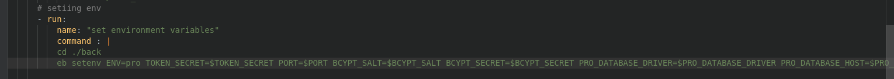

# Web App AWS Hosting

## Features
* - Pipline using CircleCli
__________________________________________________________
## Infrastructure
* AWS RDS for the database
    
    
* AWS ElasticBeanstalk for the API
    
    [Endpoint](http://storefront2-env.eba-v9zjpmhf.us-east-1.elasticbeanstalk.com/)
* AWS s3 for web hosting
    
    [Endpoint](http://storefrontfront.s3-website-us-east-1.amazonaws.com/Orders)
    **note** after sign in or up go to home route and reload to refesh jwt
______________________________________________________
## Continuous Integration Pipeline with Github
*  pipeline file using config.yml  in ./.circleci folder

* screanshot of circleci projects

    

* screanshot of circleci deploying 

    

* screanshot of circleci status in github

   

* screanshot of environment variables in circleci 

    
* screanshot of environment variables in yml file 
    
    